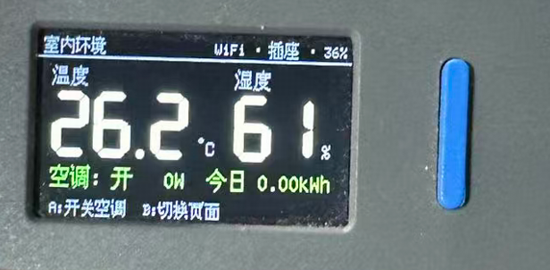

# home-assist — M5StickS3 smart-home hub



A standalone hub (no Home Assistant server needed) running on an **M5Stack StickS3**:

- Reads a **Xiaomi LYWSDCGQ** round temperature/humidity sensor via passive BLE scanning (unencrypted MiBeacon advertisements — no pairing or bind key needed).
- Controls a **TP-Link Tapo P110M** smart plug (your AC) over the local network using the KLAP protocol — no cloud dependency at runtime.
- On-device UI: readings + plug state on the LCD, **Button A** (front) toggles the AC, **Button B** (side) cycles screens (main / energy / network).
- Phone UI: open **http://m5stick.local** in a browser on the same Wi-Fi — live readings, AC toggle, energy stats.

```
[LYWSDCGQ] --BLE--> [M5StickS3] --KLAP/HTTP--> [Tapo P110M] --power--> AC
                         |
                     Wi-Fi LAN <---- phone browser (http://m5stick.local)
```

## Setup

1. **Tapo app**: enable *Me → Third-Party Services / Third-Party Compatibility* (required for local KLAP control on current P110M firmware).
2. **Router**: give the P110M a DHCP reservation / static IP.
3. Wi-Fi must be **2.4 GHz** (the ESP32-S3 has no 5 GHz radio).
4. Copy the config template and fill in your values (`.env` is gitignored; it's injected into the firmware at build time):
   ```sh
   cp .env.example .env
   ```
5. Build & flash ([PlatformIO](https://platformio.org/) required), with the StickS3 connected over USB-C:
   ```sh
   pio run -t upload && pio device monitor
   ```

If you leave `SENSOR_MAC` empty, the first LYWSDCGQ found is used; all discovered Xiaomi devices are printed on the serial monitor (`BLE: Xiaomi device found mac=...`) so you can pin the MAC afterwards.

## MCP interface (for Claude / agents)

The Stick also serves an **MCP** (Model Context Protocol) endpoint so an LLM agent can query and control it. It's the Streamable-HTTP transport (JSON-RPC 2.0) at:

```
http://m5stick.local/mcp      (or http://<stick-ip>/mcp)
```

Tools:

| Tool | Args | Purpose |
|---|---|---|
| `get_status` | — | temperature, humidity, sensor battery, plug mains state/power/energy, and last IR AC settings (`ac_ir_*`) |
| `set_ac` | `power?`, `mode?` (auto/cool/heat/dry/fan), `temp?` (16–30), `fan?` (auto/quiet/low/medium/high), `swing?` | control the Daikin AC over **IR** (like its remote) |
| `set_plug_power` | `{ "on": bool }` | Tapo P110M **mains** power (hard cutoff + energy) |

Add it to Claude Code (use the IP; mDNS `.local` also works on macOS):

```sh
claude mcp add --transport http m5stick http://192.168.40.69/mcp
```

Then in a Claude session you can ask e.g. *"What's the room temperature and is the AC on?"* or *"Turn the AC off."* — it's no-auth and LAN-only, so keep it on a trusted network.

## IR control of the Daikin AC

The StickS3 has an IR transmitter (GPIO 46) that drives the real Daikin AC (unit **AJT22UNS-W**, remote **ARC478A33**, protocol **DAIKIN152** via IRremoteESP8266's `IRac`). `set_ac` / the web UI / `POST /api/ac` send power, mode, temperature, fan, and vertical swing. The IR LED is weak — the Stick needs a short, unobstructed line of sight to the AC (1–2 m works; this is the first thing to check when the AC doesn't beep).

Identifying the protocol (already done for ARC478A33 → **DAIKIN152**): the StickS3 IR **receiver** can't be decoded by this library (it needs the RMT peripheral), so identification is done by **transmitting** — the AC beeps for the matching variant. Note the legacy RMT TX driver produced no light on this board; bit-banged TX via IRremoteESP8266 is what works:

```sh
pio run -e irtxtest -t upload && pio device monitor   # Button B cycles Daikin variants
```

`src/ir_capture.cpp` (env `ircapture`) is a receive-based attempt kept for reference; it floods with noise on this board.

## Agent skill

`skills/home-assist/SKILL.md` wraps the MCP tools with device context and common workflows (when to read climate, how to switch the AC, staleness/safety notes) so an agent uses them correctly. It's format-compatible with both Claude Code and Hermes skills — install by copying the folder:

```sh
cp -r skills/home-assist ~/.claude/skills/     # Claude Code
cp -r skills/home-assist ~/.hermes/skills/     # Hermes
```

The skill depends on the `m5stick` MCP server (above) being connected.

## Verify

- Serial log shows: `WIFI: connected`, `BLE: Xiaomi device found ... (LYWSDCGQ)`, `TAPO: connected`.
- LCD readings match the sensor's own display; Button A clicks the plug relay; the Tapo app reflects the change.
- Phone: `http://m5stick.local` shows readings and toggles the AC; toggling from the Tapo app syncs back to the stick within ~10 s.

## Notes & caveats

- **AC on a smart plug = hard power cycle.** Many air conditioners do *not* resume cooling when power returns — check that yours has an "auto-restart" feature, or set it accordingly. The StickS3 also has a built-in IR transmitter; sending real AC remote codes (temperature/mode control) would be a natural next step.
- The Tapo account credentials in `.env` are only used for the local KLAP handshake with the plug; nothing is sent to the cloud.
- Tapo firmware updates occasionally change the protocol. The vendored client (`lib/tapo_esp32/`, from [omegahiro/tapo-esp32](https://github.com/omegahiro/tapo-esp32)) implements KLAP, current as of mid-2026. The older "Passthrough" protocol is not supported.
- The stick's 250 mAh battery is tiny — keep it on USB-C power for hub duty.

## Code layout

| Path | Purpose |
|---|---|
| `src/main.cpp` | Wi-Fi/mDNS/NTP setup, main loop (buttons, Tapo polling, redraw) |
| `src/ble_sensor.*` | NimBLE passive scan + MiBeacon (0xFE95) decoder |
| `src/tapo_client.*` | KLAP client wrapper: on/off, device info, energy usage |
| `src/web_ui.*`, `src/web_ui_html.h` | Async web server: phone page + `/api/status`, `/api/plug` |
| `src/ui.*` | LCD screens (M5Canvas, flicker-free) |
| `src/state.h` | Mutex-guarded state shared between BLE / web / main tasks |
| `lib/tapo_esp32/` | Vendored KLAP protocol implementation (attribution in headers) |
